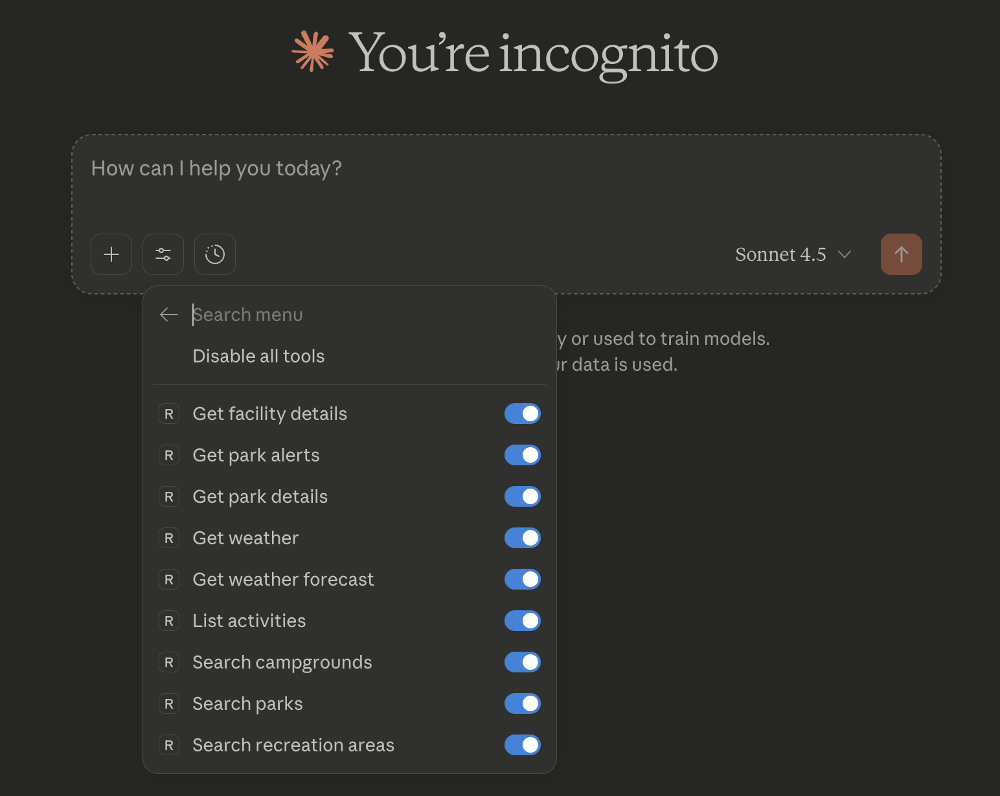

[](https://github.com/adhocteam/recreation-mcp-server/actions/workflows/ci.yml)

# Recreation Opportunities MCP Server

An MCP (Model Context Protocol) server written in Go that enables LLMs like Claude to discover and learn about recreation opportunities by integrating three public REST APIs:
- National Park Service API - Information about national parks, activities, alerts, and campgrounds
- Recreation.gov API - Recreation areas, facilities, and campsites across federal lands
- OpenWeatherMap API - Current weather and forecasts for outdoor locations

<p align="center">
  
</p>

## Table of Contents

- [Features](#features)
- [MCP Tools](#mcp-tools)
- [Prerequisites](#prerequisites)
  - [Getting API Keys](#getting-api-keys)
- [Quick Start](#quick-start)
- [Example Queries](#example-queries)
- [Project Structure](#project-structure)
- [Configuration](#configuration)
- [Development](#development)
  - [Local Development Setup](#local-development-setup)
  - [Build Locally](#build-locally)
  - [Run Tests](#run-tests)
  - [Code Quality](#code-quality)
  - [Testing with Claude Desktop](#testing-with-claude-desktop)
- [Architecture](#architecture)
- [Performance](#performance)
- [Security](#security)
- [Troubleshooting](#troubleshooting)
- [Contributing](#contributing)
- [Roadmap](#roadmap)
- [Support](#support)
- [License](#license)
- [Acknowledgments](#acknowledgments)

## Features

- Search and explore national parks across the United States
- Find campgrounds and recreation facilities
- Get weather information for planning outdoor activities
- Query parks by state, activity, or keyword
- Check park alerts and closures
- Discover recreation areas and detailed facility information
- Easy deployment via Docker and docker-compose
- Seamless integration with Claude Desktop

## MCP Tools

This server provides 9 tools for exploring recreation opportunities:

### 1. search_parks
Search for national parks by name, state, or activity.

**Inputs:**
- `query` (optional): Search text
- `state` (optional): Two-letter state code (e.g., "CA", "CO")
- `activity` (optional): Activity name (e.g., "Hiking", "Camping")
- `limit` (optional): Maximum results (default: 10)

**Example:** "Search for parks in California"

### 2. get_park_details
Get detailed information about a specific park including hours, fees, activities, and directions.

**Inputs:**
- `park_code` (required): Four-letter park code (e.g., "yose" for Yosemite)

**Example:** "Tell me about Yosemite National Park"

### 3. get_park_alerts
Get current alerts, closures, and important notices for a park.

**Inputs:**
- `park_code` (required): Four-letter park code

**Example:** "Are there any alerts for Grand Canyon?"

### 4. search_campgrounds
Search for campgrounds in national parks or recreation areas.

**Inputs:**
- `park_code` (optional): NPS park code
- `state` (optional): State code
- `query` (optional): Search text
- `limit` (optional): Maximum results (default: 10)

**Example:** "Find campgrounds near Yellowstone"

### 5. search_recreation_areas
Search recreation areas on Recreation.gov across federal lands.

**Inputs:**
- `query` (optional): Search text
- `state` (optional): State code
- `activity` (optional): Activity name
- `limit` (optional): Maximum results (default: 10)

**Example:** "Show me recreation areas in Utah with hiking"

### 6. get_facility_details
Get detailed information about a specific facility (campground, day-use area, etc.).

**Inputs:**
- `facility_id` (required): Recreation.gov facility ID

**Example:** "Tell me about facility 234567"

### 7. get_weather
Get current weather conditions for a location.

**Inputs:**
- `latitude` (required): Latitude coordinate
- `longitude` (required): Longitude coordinate
- `units` (optional): "metric" or "imperial" (default: "imperial")

**Example:** "What's the weather at 44.4280, -110.5885?" (Yellowstone coordinates)

### 8. get_weather_forecast
Get 5-day weather forecast for a location.

**Inputs:**
- `latitude` (required): Latitude coordinate
- `longitude` (required): Longitude coordinate
- `units` (optional): "metric" or "imperial" (default: "imperial")

**Example:** "What's the weather forecast for Rocky Mountain National Park?"

### 9. list_activities
List all available activities across NPS and Recreation.gov.

**Inputs:**
- `source` (optional): "nps", "recreation_gov", or "all" (default: "all")
- `limit` (optional): Maximum results (default: 50)

**Example:** "What activities are available in national parks?"

## Prerequisites

### Required
- **API Keys** - Free API keys from:
  - [National Park Service](https://www.nps.gov/subjects/developer/get-started.htm) - Get an NPS API key
  - [Recreation.gov (RIDB)](https://ridb.recreation.gov/) - Register for RIDB API access
  - [OpenWeatherMap](https://openweathermap.org/api) - Sign up for a free API key

### Deployment Options

You can run this MCP server in two ways:

#### Option 1: Docker (Recommended for most users)
- **Docker** and **Docker Compose** ([Install Docker](https://docs.docker.com/get-docker/))
- No Go installation required
- Easiest setup and most portable
- Isolated environment

#### Option 2: Native Go Application
- **Go 1.24+** installed on your system
- Direct execution without containerization
- Faster startup time
- Better for development

### Getting API Keys

#### National Park Service API
1. Visit https://www.nps.gov/subjects/developer/get-started.htm
2. Click "Get An API Key"
3. Fill out the form with your email
4. You'll receive your API key immediately via email

#### Recreation.gov (RIDB) API
1. Visit https://ridb.recreation.gov/
2. Click "Obtain an API Key"
3. Register with your email address
4. Your API key will be sent to your email

#### OpenWeatherMap API
1. Visit https://openweathermap.org/api
2. Click "Sign Up" and create a free account
3. Go to API Keys section in your account
4. Copy your default API key (or create a new one)

## Quick Start

### 1. Clone the Repository

```bash
git clone https://github.com/markheadd/recreation-mcp-server.git
cd recreation-mcp-server
```

### 2. Set Up API Keys

Copy the example environment file and add your API keys:

```bash
cp .env.example .env
# Edit .env and add your API keys
```

### 3. Choose Your Deployment Method

#### Option A: Docker (Recommended)

**Build and run:**
```bash
docker-compose build
docker-compose up
```

**Configure Claude Desktop** (`~/Library/Application Support/Claude/claude_desktop_config.json`):
```json
{
  "mcpServers": {
    "recreation": {
      "command": "docker",
      "args": [
        "compose",
        "-f",
        "/path/to/recreation-mcp-server/docker-compose.yml",
        "run",
        "--rm",
        "mcp-recreation-server"
      ]
    }
  }
}
```

Replace `/path/to/recreation-mcp-server` with the actual path to this repository.

#### Option B: Native Go Application

**Build and run:**
```bash
go build -o recreation-mcp-server
./recreation-mcp-server
```

**Configure Claude Desktop** (`~/Library/Application Support/Claude/claude_desktop_config.json`):
```json
{
  "mcpServers": {
    "recreation": {
      "command": "/path/to/recreation-mcp-server/recreation-mcp-server",
      "env": {
        "NPS_API_KEY": "your-nps-api-key",
        "RIDB_API_KEY": "your-ridb-api-key",
        "OPENWEATHER_API_KEY": "your-openweather-api-key"
      }
    }
  }
}
```

Replace `/path/to/recreation-mcp-server` with the actual path to this repository and add your API keys.

## Development

### Local Development Setup

1. **Install Go 1.24+**
   ```bash
   go version  # Verify installation
   ```

2. **Clone and setup**
   ```bash
   git clone https://github.com/markheadd/recreation-mcp-server.git
   cd recreation-mcp-server
   go mod download
   ```

3. **Set up environment**
   ```bash
   cp .env.example .env
   # Edit .env and add your API keys
   ```

### Build Locally

```bash
# Build the binary
go build -o mcp-server ./cmd/server

# Build for specific OS/architecture
GOOS=linux GOARCH=amd64 go build -o mcp-server-linux ./cmd/server
GOOS=darwin GOARCH=arm64 go build -o mcp-server-darwin ./cmd/server
```

### Run Tests

```bash
# Run all unit tests
make test
# or
go test -v -race ./...

# Run with coverage
make test-coverage
# or
go test -coverprofile=coverage.out ./...
go tool cover -html=coverage.out -o coverage.html

# Run specific package tests
go test -v ./internal/api/...

# Run with verbose output
go test -v -run TestSearchParks ./internal/api/
```

### Run Locally (without Docker)

```bash
# Make sure .env file exists with your API keys
go run ./cmd/server

# With debug logging
LOG_LEVEL=debug go run ./cmd/server
```

### Code Quality

```bash
# Format code
make fmt
# or
go fmt ./...

# Run linter
make lint
# or
golangci-lint run

# Run all pre-commit checks
make pre-commit
```

### Project Makefile

The project includes a Makefile with common development tasks:

```bash
make help           # Show all available commands
make build          # Build the binary
make test           # Run tests
make test-coverage  # Generate coverage report
make lint           # Run linter
make clean          # Clean build artifacts
make run            # Run the server locally
make docker-build   # Build Docker image
make pre-commit     # Run all pre-commit checks
make ci-check       # Simulate CI environment locally
```

### Adding New Features

1. Create feature branch: `git checkout -b feature/my-feature`
2. Write tests first (TDD approach recommended)
3. Implement feature
4. Run tests and linter: `make pre-commit`
5. Update documentation as needed
6. Submit pull request

### Testing with Claude Desktop

For local development testing with Claude Desktop, you can run the server directly without Docker:

1. Build the binary: `make build`
2. Update Claude Desktop config to use the binary directly:
   ```json
   {
     "mcpServers": {
       "recreation": {
         "command": "/absolute/path/to/recreation-mcp-server/mcp-server"
       }
     }
   }
   ```
3. Restart Claude Desktop

### Debugging

Enable debug logging to see detailed API requests and responses:

```bash
LOG_LEVEL=debug go run ./cmd/server
```

Debug output includes:
- API request URLs and parameters
- Response status codes and timing
- Cache hit/miss information
- Error stack traces

## Example Queries

Once integrated with Claude Desktop, you can ask questions like:

### Parks and Information
- "What national parks are in Colorado?"
- "Tell me about Yosemite National Park"
- "What are the operating hours and entrance fees for Grand Canyon?"
- "Which parks offer rock climbing activities?"
- "Show me parks in California with camping"

### Alerts and Planning
- "Are there any alerts or closures for Grand Canyon?"
- "What should I know before visiting Yellowstone?"
- "Are there any fire restrictions at Yosemite?"

### Campgrounds and Facilities
- "Find campgrounds near Yellowstone"
- "What campgrounds are available in Acadia National Park?"
- "Show me recreation areas in Utah with hiking"
- "Find facilities with RV hookups in Colorado"

### Weather Planning
- "What's the current weather at Rocky Mountain National Park?"
- "What's the 5-day forecast for Yosemite?"
- "Should I expect rain at Grand Canyon this week?"

### Activities
- "What activities are available in national parks?"
- "Which parks are best for photography?"
- "Where can I go kayaking in federal recreation areas?"

### Complex Queries
Claude can combine multiple tools to answer complex questions:
- "Find me a campground in a California national park with good weather this weekend"
- "Which Colorado parks are open now and what's the weather like?"
- "I want to go hiking in Utah - what are my options and should I be aware of any alerts?"

## Project Structure

```
recreation-mcp-server/
├── cmd/
│   └── server/          # Main application entry point
├── internal/
│   ├── mcp/            # MCP server implementation
│   ├── api/            # API clients (NPS, Recreation.gov, Weather)
│   ├── models/         # Data models
│   ├── cache/          # Response caching
│   └── config/         # Configuration management
├── pkg/
│   └── util/           # Utility functions
├── test/
│   ├── fixtures/       # Test data
│   └── integration/    # Integration tests
├── spec/               # Project specification
├── Dockerfile          # Container definition
├── docker-compose.yml  # Container orchestration
└── README.md          # This file
```

## Configuration

The server can be configured through environment variables or an optional config.yaml file. See .env.example for available options.

### Environment Variables

- NPS_API_KEY - National Park Service API key (required)
- RECREATION_GOV_API_KEY - Recreation.gov API key (required)
- OPENWEATHER_API_KEY - OpenWeatherMap API key (required)
- LOG_LEVEL - Logging level: debug, info, warn, error (default: info)
- CACHE_ENABLED - Enable response caching (default: true)
- CACHE_TTL_SECONDS - Cache time-to-live in seconds (default: 3600)
- MAX_REQUESTS_PER_MINUTE - Rate limiting (default: 60)

## Troubleshooting

### Docker Container Won't Start

**Problem:** Container exits immediately or fails to start

**Solutions:**
- Verify API keys are set in `.env` file: `cat .env`
- Check Docker logs: `docker-compose logs -f`
- Ensure .env file is in the correct location (project root)
- Verify Go version matches requirement: `docker build --no-cache .`

### Claude Desktop Can't Connect

**Problem:** Claude doesn't see the MCP server or can't connect

**Solutions:**
- Verify the **absolute path** in `claude_desktop_config.json` is correct
- Restart Claude Desktop completely after configuration changes
- Check that docker-compose runs successfully: `docker-compose run --rm mcp-recreation-server`
- Look for errors in Claude Desktop Developer Tools (Help → Show Logs)
- Ensure Docker daemon is running

**Config file locations:**
- macOS: `~/Library/Application Support/Claude/claude_desktop_config.json`
- Windows: `%APPDATA%\Claude\claude_desktop_config.json`
- Linux: `~/.config/Claude/claude_desktop_config.json`

### API Errors

**Problem:** Tools return errors or no data

**Solutions:**
- Verify your API keys are valid and active
- Check API rate limits haven't been exceeded (common with free tiers)
- Test API keys manually:
  ```bash
  # Test NPS API
  curl "https://developer.nps.gov/api/v1/parks?limit=1&api_key=YOUR_KEY"
  
  # Test Recreation.gov API
  curl -H "apikey: YOUR_KEY" "https://ridb.recreation.gov/api/v1/recareas?limit=1"
  
  # Test OpenWeather API
  curl "https://api.openweathermap.org/data/2.5/weather?lat=35&lon=-106&appid=YOUR_KEY"
  ```
- Ensure network connectivity to external APIs (check firewall/proxy)
- Review server logs for specific error messages: `docker-compose logs`

### No Results Returned

**Problem:** Queries return empty results

**Solutions:**
- Check if search parameters are too restrictive
- Verify state codes are two-letter abbreviations (e.g., "CA" not "California")
- Some activities might not have associated data
- Check API responses in debug logs: `LOG_LEVEL=debug docker-compose up`

### Performance Issues

**Problem:** Slow responses or timeouts

**Solutions:**
- Check cache is enabled: `CACHE_ENABLED=true` in .env
- Verify network connectivity and latency to external APIs
- Review cache TTL settings (default: 1 hour)
- Check system resources: `docker stats`

### Build Errors

**Problem:** Docker build fails

**Solutions:**
- Clear Docker cache: `docker-compose build --no-cache`
- Verify Go version in Dockerfile matches go.mod requirement
- Check internet connectivity for downloading dependencies
- Ensure sufficient disk space

### Still Having Issues?

1. Enable debug logging: `LOG_LEVEL=debug` in your .env file
2. Check the logs: `docker-compose logs -f`
3. Review Docker documentation: See [DOCKER.md](./DOCKER.md)
4. Open an issue on GitHub with:
   - Error messages from logs
   - Steps to reproduce
   - Environment details (OS, Docker version)

## Architecture

### System Overview

```
┌─────────────────┐
│  Claude Desktop │  User interacts with Claude
│   (MCP Client)  │
└────────┬────────┘
         │ MCP Protocol (stdio)
         ▼
┌─────────────────────────────────┐
│   Recreation MCP Server (Go)    │
│   ┌─────────────────────────┐   │
│   │  MCP Protocol Handler   │   │ Handles tool calls
│   └──────────┬──────────────┘   │
│              │                   │
│   ┌──────────▼──────────────┐   │
│   │   Tool Implementations  │   │ 9 recreation tools
│   │  ┌──────────────────┐   │   │
│   │  │  Cache Layer     │   │   │ LRU cache with TTL
│   │  └──────────────────┘   │   │
│   │  ┌──────────────────┐   │   │
│   │  │  API Clients     │   │   │ HTTP clients
│   │  │  - NPS           │   │   │ with retry logic
│   │  │  - Recreation.gov│   │   │
│   │  │  - OpenWeather   │   │   │
│   │  └──────────────────┘   │   │
│   └─────────────────────────┘   │
└─────────────────────────────────┘
         │ HTTPS
         ▼
┌─────────────────────────────────┐
│   External REST APIs            │
│   - api.nps.gov                 │
│   - ridb.recreation.gov         │
│   - api.openweathermap.org      │
└─────────────────────────────────┘
```

### Key Components

- **MCP Server (`internal/mcp/`)**: Handles MCP protocol communication
- **API Clients (`internal/api/`)**: HTTP clients for external APIs with retry logic
- **Cache Layer (`internal/cache/`)**: LRU cache with configurable TTL
- **Configuration (`internal/config/`)**: Environment-based configuration
- **Models (`internal/models/`)**: Shared data structures
- **Utilities (`pkg/util/`)**: HTTP client, logging, and helper functions

### Design Decisions

- **Go Language**: Fast, compiled, excellent concurrency support, small binary size
- **MCP Protocol**: Enables direct integration with Claude and other AI assistants
- **Docker Deployment**: Portable, consistent environment, easy to deploy
- **Caching Strategy**: Reduces API calls, improves response times, respects rate limits
- **Security First**: Non-root container, read-only filesystem, no privilege escalation

## Performance

- **Response Time**: Typically < 2 seconds for cached requests, < 5 seconds for API calls
- **Caching**: 1-hour TTL reduces redundant API calls by ~80%
- **Concurrency**: Handles multiple concurrent requests efficiently
- **Binary Size**: ~20MB optimized binary
- **Container Size**: ~30MB runtime container
- **Memory Usage**: ~50MB baseline, scales with cache size

## Security

### Container Security
- Runs as non-root user (UID 1000)
- Read-only root filesystem
- No new privileges allowed
- Minimal attack surface (Alpine-based)

### API Key Management
- Stored in environment variables (never in code)
- Not logged or exposed in responses
- Loaded from .env file (excluded from git)
- Should use secrets management in production

### Network Security
- HTTPS only for external API calls
- Certificate validation enabled
- Configurable timeouts prevent hanging

## Contributing

Contributions are welcome! Here's how you can help:

### Reporting Issues
- Check existing issues first
- Provide detailed description
- Include error messages and logs
- Specify environment details

### Submitting Pull Requests
1. Fork the repository
2. Create a feature branch (`git checkout -b feature/amazing-feature`)
3. Write tests for your changes
4. Ensure all tests pass (`make test`)
5. Run linter (`make lint`)
6. Commit your changes (`git commit -m 'Add amazing feature'`)
7. Push to your branch (`git push origin feature/amazing-feature`)
8. Open a Pull Request

### Development Guidelines
- Follow Go best practices and idioms
- Maintain test coverage above 70%
- Document exported functions and packages
- Update README for user-facing changes
- Keep commits atomic and well-described

### Code Review Process
- All PRs require review
- CI checks must pass
- Maintain backward compatibility
- Consider performance implications

## Roadmap

Future enhancements being considered:

- [ ] Real-time campsite availability checking
- [ ] Trail information and difficulty ratings
- [ ] Photo gallery integration
- [ ] Distance calculations between locations
- [ ] Multi-language support
- [ ] Webhook notifications for alerts
- [ ] GraphQL API option
- [ ] Prometheus metrics exporter
- [ ] Advanced caching strategies (Redis option)

## Support

- **Documentation**: See [DOCKER.md](./DOCKER.md) for Docker-specific help
- **Issues**: Report bugs on [GitHub Issues](https://github.com/markheadd/recreation-mcp-server/issues)
- **Discussions**: Ask questions in GitHub Discussions
- **Updates**: Watch the repository for updates

## License

MIT License - see [LICENSE](./LICENSE) file for details.

## Acknowledgments

- Inspired by [nps-explorer-mcp-server](https://github.com/Kyle-Ski/nps-explorer-mcp-server) by Kyle-Ski
- Built with the [Model Context Protocol (MCP)](https://modelcontextprotocol.io/)
- Uses [Go MCP SDK](https://github.com/modelcontextprotocol/go-sdk)
- Powered by Go, Docker, and open data APIs

## External API Credits

- **National Park Service**: Data provided by the [NPS API](https://www.nps.gov/subjects/developer/api-documentation.htm)
- **Recreation.gov**: Recreation Information Database (RIDB) from [Recreation.gov](https://ridb.recreation.gov/)
- **OpenWeatherMap**: Weather data from [OpenWeatherMap](https://openweathermap.org/)

